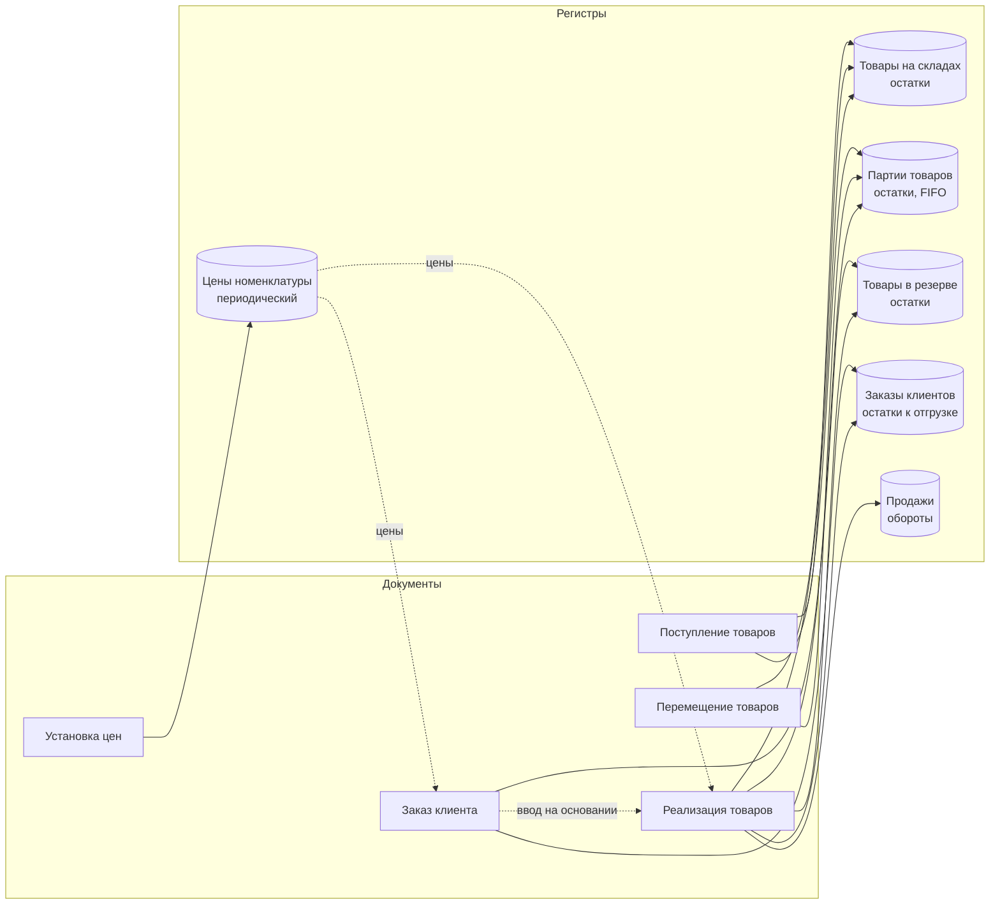

# Склад и продажи — конфигурация на 1С:Предприятие 8.3

[](https://github.com/shadelll1/MainPet/actions/workflows/checks.yml)

Прикладное решение для складского учета и продаж: партионный учет себестоимости по **FIFO** с **отложенным пересчетом** при проведении задним числом, **резервирование** товаров под заказы клиентов, контроль **свободных** остатков при конкурентном проведении, **RLS** на параметрах сеанса, отчеты на **СКД**, **REST API** на HTTP-сервисе, регламентные задания, **автотесты** бизнес-логики и **CI** со статическим анализом.

Проект демонстрирует не набор объектов, а решения типовых для учетных систем задач: корректное проведение при перепроведении и сдвиге даты, пересчет себестоимости «хвоста» после изменений задним числом, отсутствие гонок при параллельной работе, консистентность резервов при частичной отгрузке и закрытии заказа, разграничение доступа на уровне записей.

| | |
|---|---|
| Платформа | 1С:Предприятие 8.3.27, управляемое приложение, режим совместимости `Version8_3_27` |
| Режим блокировок | управляемый |
| Исходники | XML-выгрузка Конфигуратора, формат `Hierarchical`, UTF-8 с BOM |
| Объем | 5 справочников, 5 документов, 5 регистров накопления, 1 регистр сведений, 15 общих модулей, 3 отчета на СКД, HTTP-сервис, 2 регламентных задания, 6 ролей с RLS, 15 автотестов |
| Качество | автотесты в откатываемых транзакциях, GitHub Actions: BSL Language Server + собственные проверки исходников |

## Содержание

- [Возможности](#возможности)
- [Архитектура](#архитектура)
- [Ключевые технические решения](#ключевые-технические-решения)
- [REST API](#rest-api)
- [Развертывание](#развертывание)
- [Сценарий демонстрации](#сценарий-демонстрации)
- [Качество кода и CI](#качество-кода-и-ci)
- [Структура репозитория](#структура-репозитория)
- [Ограничения и развитие](#ограничения-и-развитие)

## Возможности

**Склад**
- Поступление товаров → партии себестоимости (партия = документ поступления).
- Перемещение между складами: партия переезжает вместе со своей стоимостью.
- Остатки в разрезе «в наличии / в резерве / свободно» и себестоимость запаса (отчет «Остатки товаров»).

**Продажи**
- Заказ клиента со статусами *Новый → К отгрузке → Закрыт*. «К отгрузке» резервирует товар на складе.
- Реализация — вводом на основании заказа (заполняется **неотгруженным остатком**, а не табличной частью заказа) или без заказа.
- Себестоимость продаж по FIFO, отчеты «Валовая прибыль» (по номенклатуре / по клиентам) и «ABC-анализ продаж».
- Проведение задним числом не ломает себестоимость: отмечается граница, с которой документы перепроводятся регламентным заданием или командой администратора.
- Печатная форма накладной (сумма прописью, несколько документов — постранично).
- Автозакрытие просроченных заказов регламентным заданием с освобождением резерва.

**НСИ и администрирование**
- Проверка ИНН по контрольным разрядам (10 и 12 знаков), КПП, уникальность ИНН+КПП и артикула.
- Цены номенклатуры (периодический регистр) подставляются в заказ и реализацию автоматически.
- Дата запрета изменения: документы закрытого периода нельзя записать, провести, распровести или перенести.
- Роли: полные права, базовые, менеджер, кладовщик, управление ценами, интеграция.
- Пользователи и параметр сеанса «Текущий пользователь»; ответственный в документах заполняется автоматически, менеджер видит и меняет только свои заказы и реализации (RLS).
- Демо-данные и самопроверка (автотесты) запускаются командами раздела «Администрирование».

## Архитектура



Код разложен по ответственности:

| Модуль | Назначение |
|---|---|
| `ПроведениеСервер` | подготовка наборов записей, управляемые блокировки, контроль свободных остатков после записи |
| `ПартионныйУчетСервер` | расчет списания партий по FIFO, граница и отложенный пересчет себестоимости |
| `ЗаказыКлиентовСервер` | остатки к отгрузке, контроль отгрузки сверх заказа, закрытие просроченных заказов |
| `ЦенообразованиеСервер` | срез цен, заполнение цен и сумм |
| `ДатыЗапретаИзменения` | обработчик подписки на событие «Перед записью» всех документов |
| `ИнтеграцияAPIСервер` | REST API: разбор и валидация JSON, ответы с кодами HTTP |
| `ПечатьСервер` | печатная форма накладной |
| `Самопроверка` | автотесты бизнес-логики |
| модуль сеанса, `Справочники.Пользователи` | установка параметра сеанса `ТекущийПользователь`, создание пользователя при первом входе |
| модули менеджеров документов | запросы `ДанныеДляПроведения` — данные для движений, свернутые по ключам регистров |

## Ключевые технические решения

### Проведение: «новая методика» с контролем после записи

```
ОбработкаПроведения
 ├─ ПодготовитьНаборыЗаписей      все наборы очищены и помечены к записи
 ├─ ДанныеДляПроведения           запрос; строки СВЕРНУТЫ по ключам регистров, услуги отброшены
 ├─ Заблокировать...              исключительные управляемые блокировки ДО чтения остатков
 ├─ ОчиститьДвиженияВБазе         старые движения документа не должны попасть в остатки на его момент
 ├─ РассчитатьСписаниеFIFO        остатки партий на Граница(МоментВремени, Исключая)
 ├─ формирование движений
 ├─ ЗаписатьДвижения              контролируемые регистры пишутся сразу
 └─ ПроверитьСвободныеОстатки     запрос к остаткам ПОСЛЕ записи: (в наличии − в резерве) ≥ 0
```

Почему так:
- **Контроль после записи**, а не «остаток минус количество строки»: регистр сам суммирует движения всех строк документа по одному ключу, поэтому одна номенклатура в нескольких строках не обходит проверку. Это покрыто отдельным тестом.
- **Блокировка до чтения**: без нее два параллельных документа прочитают один и тот же остаток и оба пройдут контроль.
- **Остатки на момент документа** для партий и резерва: проведение задним числом списывает те партии, что были на складе на дату документа.
- **Ключи старых движений** в контроле поступлений и перемещений: если при перепроведении строку удалили или уменьшили, а товар из нее уже продан, отказ будет и по «исчезнувшему» ключу.
- **Контроль при отмене проведения**: распровести поступление, из которого уже продавали, нельзя.

### Проведение задним числом и пересчет себестоимости

FIFO-себестоимость продажи зависит от всех документов до нее. Если поступление, перемещение или продажу провести задним числом (или изменить дату, отменить проведение), себестоимость более поздних продаж станет неверной. Перепроводить весь «хвост» прямо в транзакции пользователя нельзя — это долго и держит блокировки. Поэтому сделано как восстановление последовательности:

1. Документ при проведении проверяет, есть ли **после его даты** движения партий других документов по той же номенклатуре. Учитывается и прежняя дата документа, если ее сдвинули.
2. Если есть — константа «Граница пересчета себестоимости» сдвигается на эту дату (только назад, под управляемой блокировкой константы).
3. Регламентное задание (ночью) или команда администратора перепроводит документы с границы **в порядке `МоментВремени`**. Документы, которые перепроводит сам пересчет, границу не двигают.
4. Граница сбрасывается по принципу «сравнить и заменить»: если пока шел пересчет кто-то провел документ еще раньше, новая граница не теряется. Если документ перепровести не удалось — граница переносится на него, следующий запуск продолжит с этого места.
5. Документы закрытого периода (дата запрета изменения) не перепроводятся — их себестоимость зафиксирована.

### RLS и параметры сеанса

- Справочник `Пользователи` связан с пользователями ИБ по идентификатору; элемент создается при первом входе (под блокировкой, без дублей). Модуль сеанса устанавливает параметр `ТекущийПользователь`.
- Реквизит `Ответственный` в документах заполняется текущим пользователем.
- В роли `Менеджер` на чтение, добавление и изменение заказов и реализаций стоит ограничение `Ответственный = &ТекущийПользователь`. Проведение выполняется в привилегированном режиме, поэтому регистры и чужие данные в расчетах доступны, а в списках и отчетах менеджер видит только свое.

### Резервы и закрытие заказа без отрицательных остатков

Реализация по заказу списывает и «остаток к отгрузке», и резерв (не больше, чем было зарезервировано). Если просто перестать делать движения по закрытому заказу, расходы реализаций останутся — регистры уйдут в минус. Поэтому при закрытии приход заказа **приравнивается к уже использованному** реализациями (запрос по расходам других регистраторов), и остатки по заказу становятся ровно нулевыми. Тот же прием работает при возврате статуса в «Новый». Уже проведенную реализацию по закрытому заказу можно перепровести (это нужно пересчету себестоимости), а новую отгрузку — нельзя.

### FIFO

Партии выбираются упорядоченными по `Партия.МоментВремени`. При полном списании партии забирается вся ее остаточная стоимость (нет копеечных «хвостов» округления), при частичном — пропорционально. Нехватка партий на момент документа — отдельное сообщение.

### REST API

Тонкий HTTP-сервис (только перехват исключений → JSON 500) и вся логика в общем модуле. Идентификаторы — предметные: артикул, код склада, ИНН, UUID заказа. Валидация собирает **все** ошибки запроса, а причины отказа проведения возвращаются клиенту кодом 422.

### Отчеты на СКД

- **Остатки товаров** — объединение трех виртуальных таблиц остатков (наличие, резерв, партии) в одном наборе.
- **Валовая прибыль** — вычисляемое поле «Рентабельность» с собственным выражением итога (рентабельность группы считается от сумм, а не суммируется по строкам), два варианта отчета.
- **ABC-анализ** — пакетный запрос с временными таблицами и накопительным итогом через соединение таблицы с самой собой.

### Автотесты

15 тестов в общем модуле `Самопроверка`: FIFO, контроль остатков, дубли строк, резервы, частичная отгрузка, закрытие заказа, перепроведение отгрузки по закрытому заказу, отгрузка сверх заказа, перемещение партии, уменьшение и отмена проведенного поступления, пересчет себестоимости после проведения задним числом, ответственный в документах, дата запрета, проверка ИНН. Каждый тест создает свои данные в транзакции, которая **всегда откатывается** — тесты безопасно запускать на рабочей базе. Результат — табличный документ с зелеными/красными строками.

## REST API

HTTP-сервис `API`, корневой URL `api`. После публикации базы на веб-сервере (Конфигуратор → Администрирование → Публикация на веб-сервере) пользователю интеграции нужны роли `БазовыеПрава` и `ИнтеграцияAPI`.

| Метод | URL | Описание |
|---|---|---|
| GET | `/hs/api/v1/stock?warehouse=<код>` | свободные остатки (параметр необязателен) |
| GET | `/hs/api/v1/products` | номенклатура с действующими ценами |
| POST | `/hs/api/v1/orders` | создать и провести заказ клиента |
| GET | `/hs/api/v1/orders/{id}` | заказ с отгруженным количеством и остатком к отгрузке |

```bash
BASE=http://localhost/mainpet/hs/api/v1

curl -u api: "$BASE/stock"

curl -u api: -X POST "$BASE/orders" -H "Content-Type: application/json" -d '{
  "customer_inn": "5003123458",
  "shipment_date": "2026-10-05",
  "reserve": true,
  "items": [ { "sku": "NB-001", "quantity": 2 }, { "sku": "SV-001", "quantity": 1 } ]
}'
```

Ответ `201 Created` (заголовок `Location` указывает на заказ):

```json
{"id":"3f0c...","number":"00000000003","date":"2026-09-26T12:00:00","status":"to_ship",
 "customer":"ООО \"Альфа-Офис\"","warehouse":"Основной склад","shipment_date":"2026-10-05",
 "total":125500,"comment":"",
 "items":[
  {"sku":"SV-001","name":"Настройка рабочего места","quantity":1,"amount":1500,"shipped":0,"remaining":1},
  {"sku":"NB-001","name":"Ноутбук 15.6\" Core i5 / 16 ГБ / 512 ГБ","quantity":2,"amount":124000,"shipped":0,"remaining":2}]}
```

Ошибки — единым форматом:

```json
{"error":{"code":"order_not_posted","message":"Заказ не может быть проведен",
 "details":["Недостаточно свободного остатка товара «...» на складе «Основной склад»: не хватает 3"]}}
```

| Код | Когда |
|---|---|
| 400 | некорректный JSON или поля (`invalid_json`, `validation_failed`, `invalid_id`) |
| 404 | склад или заказ не найден |
| 422 | заказ не проведен (нет свободного остатка, закрытый период и т.п.) |
| 500 | непредвиденная ошибка; подробности — в журнале регистрации |

## Развертывание

Нужна платформа 1С:Предприятие 8.3.27 (подходит учебная версия).

1. Проверить путь к платформе в `load.bat` (`V8=...\1cv8t.exe`; для полной версии — `1cv8.exe`).
2. Закрыть Конфигуратор и клиент, запустить `load.bat`: он создаст файловую базу в `base\`, загрузит конфигурацию из `src\` и обновит структуру БД. При ошибке — смотреть `load.log`.
3. Запустить 1С:Предприятие, раздел **Администрирование** → «Заполнить демо-данные», затем «Запустить самопроверку».

Изменения, сделанные в Конфигураторе, выгружаются обратно в `src\` скриптом `dump.bat`.

## Сценарий демонстрации

1. **Администрирование → Заполнить демо-данные.** Создаются два поступления ноутбуков по 45 000 и 47 000, перемещение в магазин, заказ организации с резервом, частичная отгрузка по нему и розничная продажа.
2. **Склад → Остатки товаров.** Видно, что на основном складе часть ноутбуков в резерве, а свободный остаток меньше наличия.
3. **Продажи → Валовая прибыль.** Себестоимость ноутбуков — по первой партии (FIFO).
4. **Попытка продать больше свободного остатка**: новая реализация без заказа с основного склада на 8 ноутбуков NB-001. Физически их 9, но 2 зарезервированы под заказ — отказ «Недостаточно свободного остатка… не хватает 1 (зарезервировано под заказы: 2)».
5. **Закрыть заказ** (статус «Закрыт») — резерв освобождается, свободный остаток растет. Или дождаться регламентного задания: демо-заказ просрочен, задание закроет его после истечения срока резервирования (константа, 3 дня).
6. **Пересчет себестоимости.** Создайте поступление 10 шт. NB-001 датой 25 дней назад (раньше демо-поставок) по 40 000 и проведите. В разделе «Администрирование» заполнится «Граница пересчета себестоимости». Команда **Пересчитать себестоимость** перепроведет документы с этой даты, и в «Валовой прибыли» себестоимость ноутбуков станет 40 000 — теперь FIFO берет более раннюю партию.
7. **Администрирование → Запустить самопроверку** — отчет по 15 тестам.
8. **Установить дату запрета изменения** вчерашним днем и попробовать перепровести демо-документ — отказ.
9. **RLS.** В Конфигураторе (Администрирование → Пользователи) создайте сначала пользователя «Администратор» с ролью «Полные права», затем «Менеджер» с ролями «Базовые права» и «Менеджер по продажам». Под менеджером списки заказов и реализаций пусты; созданный им заказ виден только ему.

> Порядок в п. 9 важен: как только в базе появляется хотя бы один пользователь, вход без выбора пользователя невозможен, и без администратора с полными правами вы не попадете ни в Конфигуратор, ни в административные команды.

## Качество кода и CI

На каждый push GitHub Actions запускает `.github/workflows/checks.yml`:

- **BSL Language Server** — статический анализ всего кода (`.bsl-language-server.json`); замечания уровня Error роняют сборку, отчет сохраняется артефактом. Отключено только правило `StyleElementConstructors` — в конфигурации нет стилей, цвета и шрифты печатной формы задаются явно.
- **`tools/check_sources.py`** — проверки, которых нет в анализаторе и которые иначе всплывают только в рантайме:
  кодировка UTF-8 с BOM и CRLF, корректность XML, **число параметров `СтрШаблон`** (лишний параметр — ошибка времени выполнения),
  **существование и экспортность** вызываемых методов общих модулей и менеджеров, ссылки на объекты метаданных и значения перечислений.

## Структура репозитория

```
src/                         исходники конфигурации (XML + BSL, формат Hierarchical)
  Configuration.xml          корень: свойства и состав конфигурации
  Catalogs/ Documents/ ...   объекты метаданных; модули в <Объект>/Ext/*.bsl
  CommonModules/<Имя>/Ext/Module.bsl
  Reports/<Имя>/Templates/ОсновнаяСхемаКомпоновкиДанных/Ext/Template.xml   схемы СКД
  HTTPServices/API/Ext/Module.bsl
  Ext/SessionModule.bsl      модуль сеанса
tools/                       проверки исходников для CI и локального запуска
.github/workflows/           GitHub Actions
docs/development.md          правила разработки и соглашения по коду
load.bat                     src -> база (+ создание базы и обновление структуры БД)
dump.bat                     база -> src (инкрементально)
```

## Ограничения и развитие

Осознанно не сделано в текущей версии:

- **Формы** — автогенерируемые платформой. Следующий шаг: форма документа с пересчетом суммы при изменении количества/цены, подбором и показом свободного остатка.
- **НДС, валюты, организации** — вне рамок учебного примера.
- **Пересчет себестоимости** выполняется целиком по «хвосту» документов. Для больших баз следующий шаг — пересчет только затронутой номенклатуры и порциями.
- Ограничения учебной версии платформы: один сеанс, до 2000 записей в основных таблицах.
